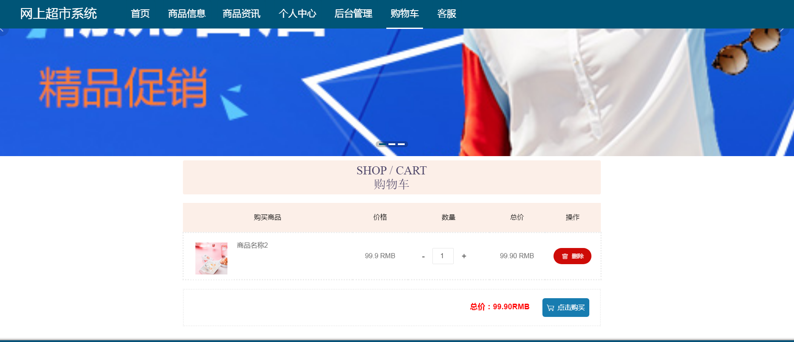
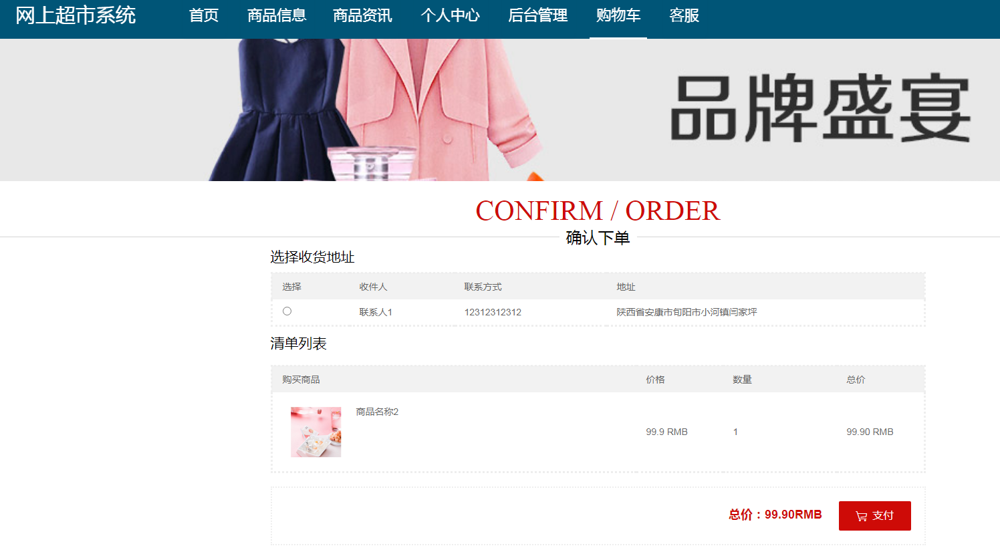
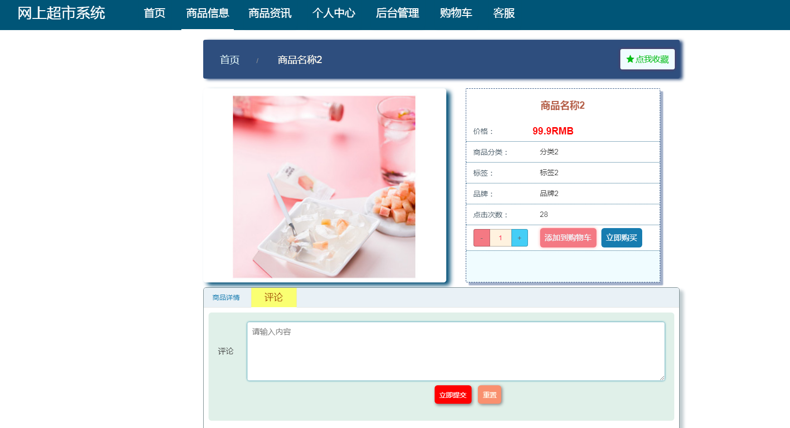

## 基于SpringBoot网上超市(程序+报告)

- <b>完整代码获取地址：从戎源码网 ([https://armycodes.com/](https://armycodes.com/))</b>
- <b>技术探讨、资料分享，请加QQ群：692619798</b> 
- <b>作者微信：19941326836  QQ：952045282</b> 
- <b>承接计算机毕业设计、Java毕业设计、Python毕业设计、深度学习、机器学习</b>
- <b>选题+开题报告+任务书+程序定制+安装调试+论文+答辩ppt 一条龙服务</b>
- <b>所有选题地址 ([https://github.com/YuLin-Coder/AllProjectCatalog](https://github.com/YuLin-Coder/AllProjectCatalog)) </b>

## 项目介绍
基于SpringBoot网上超市，系统包含两种角色：用户、管理员，系统分为前台和后台两大模块，主要功能如下：

1 管理员功能实现

商品信息管理  
管理员可以通过提交商品名称查询商品，并查看该商品的用户评论信息。  

用户管理  
管理员通过提交用户名来获取用户资料，对有异常情况的用户信息进行修改，并可以详细查看用户资料。  

商品评价管理  
管理员审核用户对商品的评价，经过审核的评价才会显示，并可以统计商品评价信息。  

已支付订单  
管理员查看已支付的订单，并逐个进行订单发货。  

2 用户功能实现

商品信息  
用户可以收藏、立即购买商品，或对商品进行评价，同时将商品添加到购物车。  

购物车  
用户可以直接下单购买购物车中的商品，或删除购物车中的商品。  

确认下单  
用户选择地址，查看支付金额信息，以确认订单之前的所有细节。  

已支付订单  
用户查看已支付的订单，若对购买商品产生后悔，可以申请退款。

## 项目技术
- 编程语言：Java
- 数据库：MySQL
- 项目管理工具：Maven
- 前端技术：HTML、CSS、JavaScript、Jquery、Vue
- 后端技术：Spring、SpringMVC、MyBatis

## 运行环境
- JDK版本：JDK1.8及以上
- 开发工具：IDEA、Ecplise、Myecplise都可以
- 数据库: MySQL5.7及以上
- Maven：maven3.0及以上
- Node：14.14.0及以上

## 运行截图

